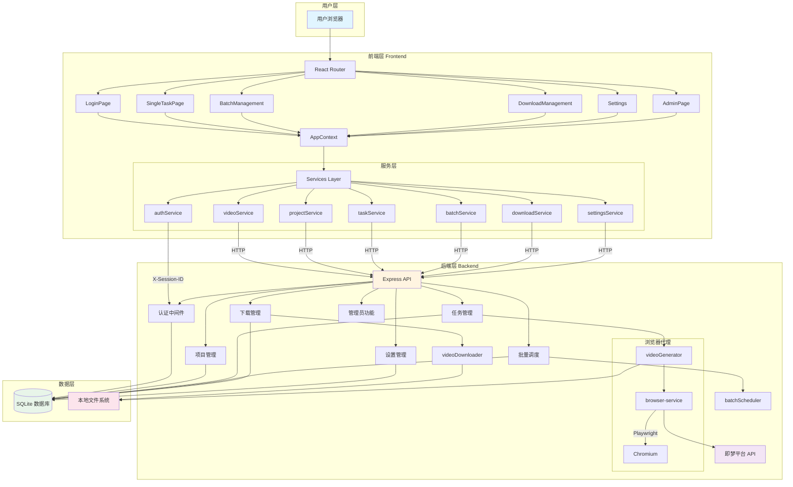
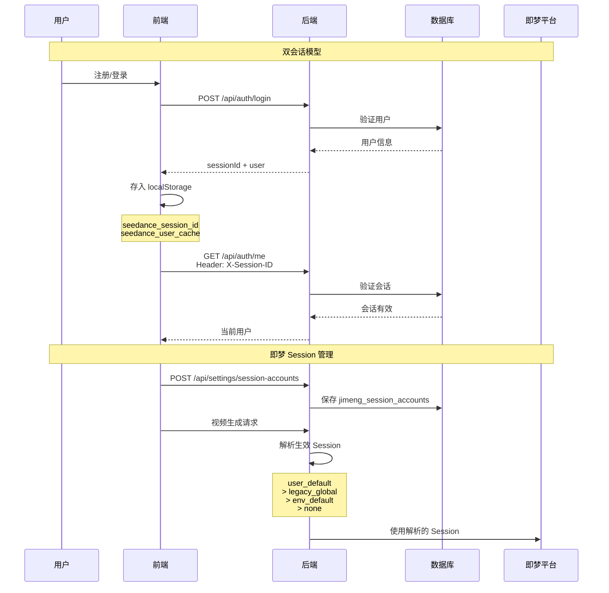
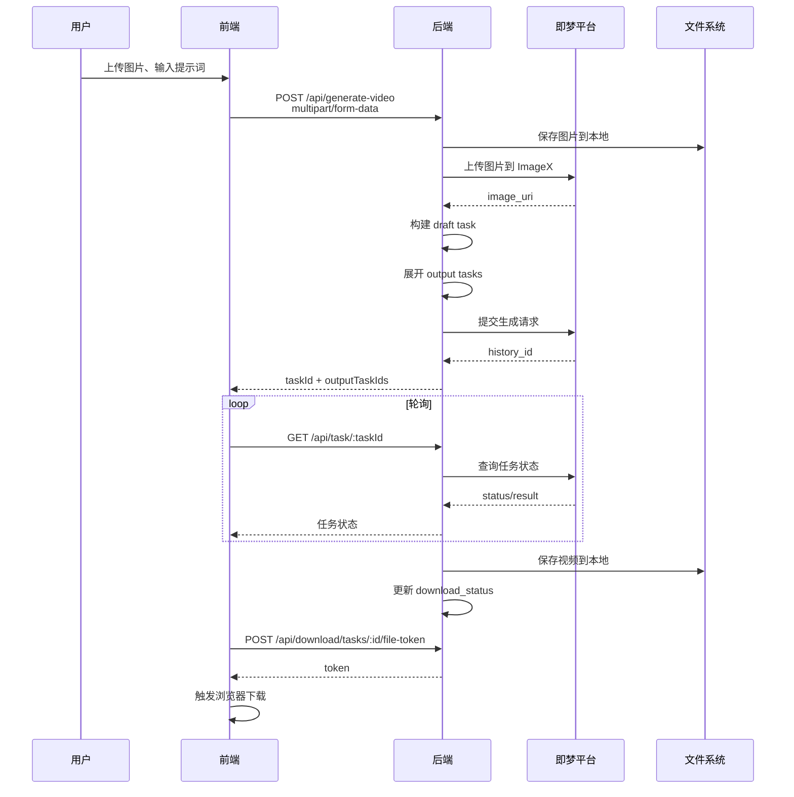
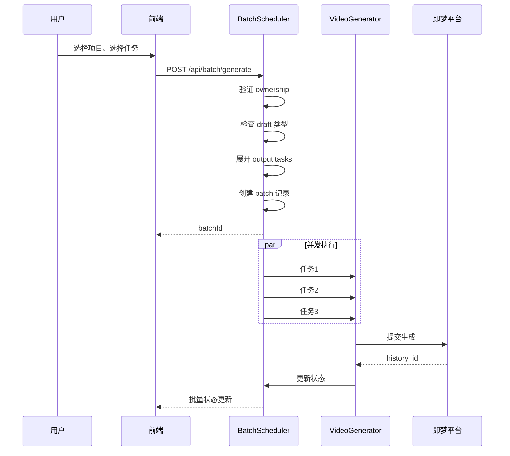
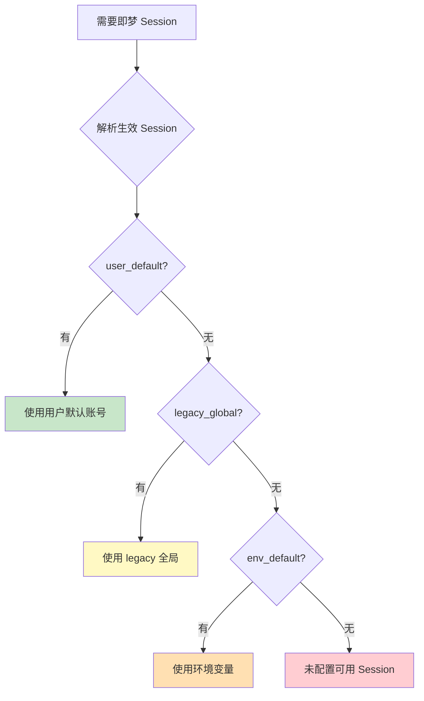
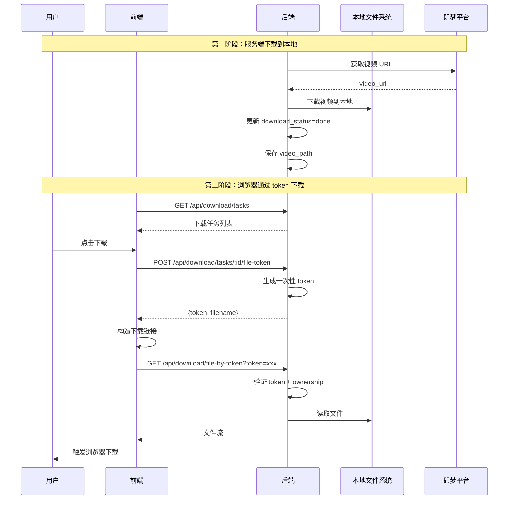
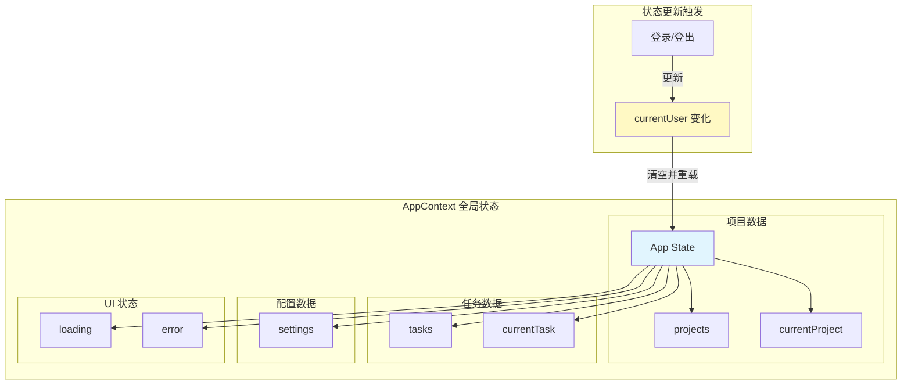
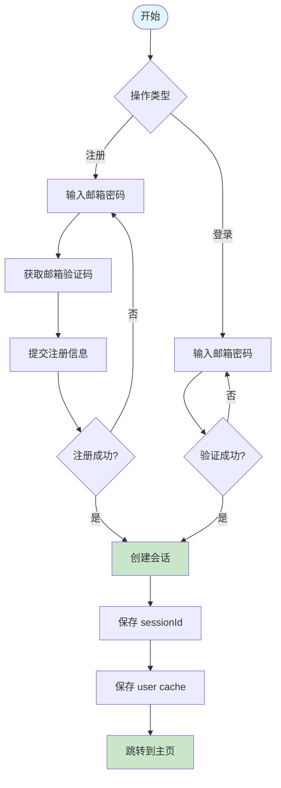
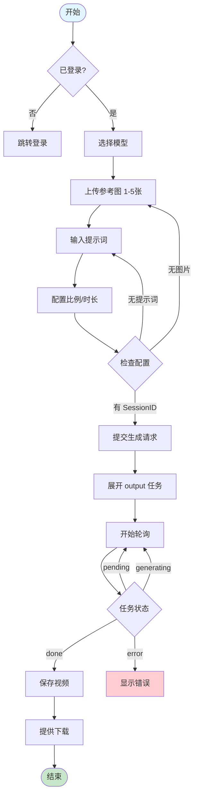

# Seedance 2.0 系统架构图

## 文档信息

| 项目 | 内容 |
|------|------|
| 产品名称 | Seedance 2.0 AI 视频生成 |
| 文档版本 | v1.0.0 |
| 创建日期 | 2026-04-07 |
| 文档状态 | 系统架构可视化 |

---

## 1. 整体架构图



---

## 2. 认证与会话架构



---

## 3. 双层任务模型

```mermaid
graph LR
    subgraph "前端编辑"
        D1[草稿任务 Draft]
        D1 -->|video_count| N{计划输出数}
    end

    subgraph "后端展开"
        N -->|展开| O1[Output 1]
        N -->|展开| O2[Output 2]
        N -->|展开| O3[Output N]
    end

    subgraph "执行生成"
        O1 & O2 & O3 --> G[视频生成器]
        G --> JM[即梦平台]
        JM --> G
        G --> O1 & O2 & O3
    end

    subgraph "状态流转"
        O1 & O2 & O3 --> S1[pending]
        S1 --> S2[generating]
        S2 --> S3[done]
        S2 --> E[error]
    end

    style D1 fill:#fff9c4
    style O1 & O2 & O3 fill:#c8e6c9
    style JM fill:#e1bee7
```

---

## 4. 数据流架构

### 4.1 单任务生成流程



### 4.2 批量生成流程



---

## 5. 权限与数据隔离

```mermaid
graph TB
    subgraph "普通用户"
        U1[用户 A]
        U1 --> P1[项目 A1, A2, A3]
        U1 --> T1[任务 A_xxx]
        U1 --> D1[下载记录 A_xxx]
    end

    subgraph "普通用户"
        U2[用户 B]
        U2 --> P2[项目 B1, B2]
        U2 --> T2[任务 B_xxx]
        U2 --> D2[下载记录 B_xxx]
    end

    subgraph "管理员"
        ADMIN[Admin]
        ADMIN --> PALL[全部项目]
        ADMIN --> TALL[全部任务]
        ADMIN --> DALL[全部下载记录]
        ADMIN --> UALL[用户管理]
    end

    style U1 fill:#e3f2fd
    style U2 fill:#e3f2fd
    style ADMIN fill:#fff3e0
    style PALL & TALL & DALL fill:#fff3e0
```

---

## 6. 即梦 Session 账号解析



---

## 7. 下载链路架构



---

## 8. 前端状态管理



---

## 9. 目录结构图

```
seedanceGUI/
├── seedance-temp/
│   ├── src/                          # 前端源码
│   │   ├── main.tsx                  # 应用入口
│   │   ├── App.tsx                   # 根组件（路由）
│   │   ├── types/                    # 类型定义
│   │   │   └── index.ts              # 核心类型
│   │   ├── context/                  # 全局状态
│   │   │   └── AppContext.tsx        # 应用上下文
│   │   ├── components/               # 公共组件
│   │   │   ├── Sidebar.tsx           # 侧边栏
│   │   │   ├── VideoPlayer.tsx       # 视频播放器
│   │   │   └── Icons.tsx             # 图标组件
│   │   ├── pages/                    # 页面组件
│   │   │   ├── LoginPage.tsx         # 登录页
│   │   │   ├── RegisterPage.tsx      # 注册页
│   │   │   ├── SingleTaskPage.tsx    # 单任务页
│   │   │   ├── BatchManagement.tsx   # 批量管理页
│   │   │   ├── DownloadManagement.tsx # 下载管理页
│   │   │   ├── Settings.tsx          # 设置页
│   │   │   └── AdminPage.tsx         # 管理员页
│   │   └── services/                 # API 服务
│   │       ├── authService.ts        # 认证服务
│   │       ├── videoService.ts       # 视频服务
│   │       ├── projectService.ts     # 项目服务
│   │       ├── taskService.ts        # 任务服务
│   │       ├── batchService.ts       # 批量服务
│   │       ├── downloadService.ts    # 下载服务
│   │       └── settingsService.ts    # 设置服务
│   ├── server/                       # 后端源码
│   │   ├── index.js                  # Express 入口
│   │   ├── browser-service.js        # 浏览器代理
│   │   ├── database/                 # 数据库
│   │   │   ├── index.js              # 数据库初始化
│   │   │   └── schema.sql            # 数据库结构
│   │   └── services/                 # 业务服务
│   │       ├── authService.js        # 认证服务
│   │       ├── projectService.js     # 项目服务
│   │       ├── taskService.js        # 任务服务
│   │       ├── settingsService.js    # 设置服务
│   │       ├── jimengSessionService.js # Session 管理
│   │       ├── batchScheduler.js     # 批量调度器
│   │       ├── videoDownloader.js    # 视频下载器
│   │       └── videoGenerator.js     # 视频生成器
│   ├── data/                         # 数据目录
│   │   ├── seedance.db               # SQLite 数据库
│   │   ├── api-keys.json             # API 配置
│   │   ├── assets/                   # 素材文件
│   │   ├── cache/                    # 缓存
│   │   ├── tasks/                    # 任务文件
│   │   └── videos/                   # 下载视频
│   ├── doc/                          # 文档目录
│   │   ├── PRD.md                    # 产品需求
│   │   ├── 概要设计.md                # 概要设计
│   │   ├── 详细设计.md                # 详细设计
│   │   ├── 数据字典.md                # 数据字典
│   │   ├── API_ARCHITECTURE.md       # API 架构
│   │   ├── API_DOCUMENTATION.md      # API 文档
│   │   ├── API_UI_BINDING.md         # API-UI 绑定
│   │   └── 系统架构图.md              # 系统架构图（本文档）
│   ├── package.json                  # 前端依赖
│   ├── vite.config.ts                # Vite 配置
│   ├── tsconfig.json                 # TS 配置
│   ├── tailwind.config.js            # Tailwind 配置
│   ├── Dockerfile                    # Docker 构建
│   ├── docker-compose.yml            # Docker Compose
│   ├── .env.example                  # 环境变量模板
│   ├── README.md                     # 项目说明
│   └── CLAUDE.md                     # Claude 指引
```

---

## 10. 技术栈总览

```mermaid
graph TB
    subgraph "前端 Frontend"
        F1[React 19]
        F2[TypeScript 5.6]
        F3[Vite 6]
        F4[Tailwind CSS 3.4]
        F5[React Router 6.22]
    end

    subgraph "后端 Backend"
        B1[Node.js 16+]
        B2[Express 4.21]
        B3[Multer 1.4]
        B4[Nodemailer 8.0]
    end

    subgraph "数据库 Database"
        D1[SQLite 3]
        D2[better-sqlite3 11.8]
    end

    subgraph "浏览器自动化"
        P1[Playwright-core 1.49]
        P2[Chromium]
    end

    subgraph "外部服务"
        E1[即梦 Seedance API]
        E2[ImageX CDN]
        E3[SMTP 邮件]
    end

    style F1 & F2 & F3 & F4 & F5 fill:#e3f2fd
    style B1 & B2 & B3 & B4 fill:#fff3e0
    style D1 & D2 fill:#e8f5e9
    style P1 & P2 fill:#f3e5f5
    style E1 & E2 & E3 fill:#fce4ec
```

---

## 11. 核心业务流程图

### 11.1 用户注册登录流程



### 11.2 视频生成流程



---

## 12. 维护索引

| 模块 | 相关文件 | 说明 |
|------|----------|------|
| **认证系统** | `authService.ts`, `authService.js`, `App.tsx` | 登录/注册/会话 |
| **路由保护** | `App.tsx`, `AppContext.tsx` | ProtectedRoute |
| **项目管理** | `projectService.ts`, `projectService.js` | CRUD + ownership |
| **任务管理** | `taskService.ts`, `taskService.js` | draft/output 模型 |
| **批量调度** | `batchService.ts`, `batchScheduler.js` | 并发控制 |
| **下载管理** | `downloadService.ts`, `videoDownloader.js` | token 链路 |
| **Session 管理** | `settingsService.ts`, `jimengSessionService.js` | 多账号 |
| **视频生成** | `videoService.ts`, `videoGenerator.js`, `browser-service.js` | 即梦集成 |
| **状态管理** | `AppContext.tsx` | 全局状态 |
| **类型定义** | `types/index.ts` | TypeScript 类型 |
| **数据库** | `schema.sql`, `database/index.js` | SQLite 结构 |

---

**文档版本**: v1.0.0
**最后更新**: 2026-04-07
**维护者**: Seedance 开发团队
